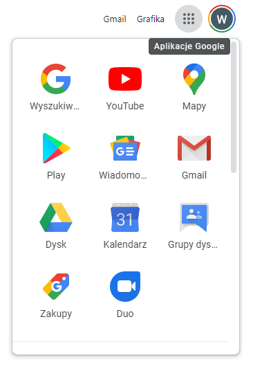

# Współdzielenie plików i dokumentów w czasie rzeczywistym

Obecnie jedną z najczęściej świadczonych usług informatycznych jest przechowywanie danych na serwerach zdalnych. W chwili obecnej poza tą podstawową funkcjonalnością coraz częściej użytkownicy potrzebują posiadać możliwość edycji dokumentów w czasie rzeczywistym, wraz ze swoimi współpracownikami.

Na rynku usług informatycznych w tym zakresie najbardziej popularne są dwa rozwiązania [Google Drive](https://drive.google.com/) i [Microsoft One Drive](https://onedrive.live.com/).

## Zadanie 1.
1. Zaloguj się na swoje konto google i przejdź do kalendarza. 

2. Dodaj dowolne jednorazowe wydarzenie i zaproś do niego wybraną osobę, ustaw przypomnienie i miejsce spotkania.
3. Dodaj wydarzenie cykliczne do swojego kalendarz, które będzie odbywać się co tydzień do końca semestru.
4. Dodaj kalendarz wydarzeń który Cię zainteresuje. W tym celu odnajdź w lewej części ekranu sekcję **Inne kalendarze** i wybierz znak **+**. W rozwiniętym menu odnajdź *Przeglądaj pomocne kalendarze* i wybierz ten który Cię interesuje.
5. W podobny sposób jak w powyższym punkcie za subskrybuj kalendarz innej osoby z grupy. Pamiętaj by odpowiedni skonfigurować możliwość edycji wydarzeń przez subskrybenta.
6. Utwórz nowy kalendarz w zakładce **Inne kalendarze** i zaproś do niego trzy osoby.

## Zadanie 2.
1. Przejdź do [dysku Google](https://drive.google.com/) 
2. Przy pomocy przycisku **Nowy** stwórz folder o dowolnej nazwie i wejdź do niego.
3. Wewnątrz folderu stwórz dokument tekstowy i zaproś do jego edycji trzy osoby. Można to zrobić przez ikonkę  w prawym górnym rogu, bezpośrednio w dokumencie przyciskiem **Udostępnij** lub z menu kontekstowego z pozycji **Udostępnij**.
4. W udostępnionym dokumencie sprawdź jak działa zarządzanie poziomem edycji. W tym celu jeszcze raz przejdź do opcji **Udostępnij** i w okienku które się pojawi w lewym dolnym rogu odszukaj opcję *zaawansowane*. Zmień poziomy dostępu wybranym osobom i zaobserwujcie wspólnie jak teraz działa system.
5. Dodaj komentarz do wpisanego tekstu w dokumencie, następnie w treści komentarza wstaw znak **+**, co się stało? Przetestuj opcję przydzielania zadań z pozycji komentarza w dokumencie.
6. Po dokonaniu edycji w środkowej części ekranu znajduje się status zmian dokumentu, kliknij w niego. Jakie opcje oferuje śledzenie zmian?
7. Zmień opcję edycji dokumentu dla samego siebie, prawy róg edytora tuż nad polem edycji. Sprawdź jak widzą twoje zmiany członkowie zespołu gdy jesteś w trybie **Sugerowanie**.
8. Sprawdź czy inne typy dokumentów posiadają podobne opcje.
9. Za pomocą opcji **Pobierz dodatki** (dla dysku Google), symbol plus na prawym pasku interfejsu, przejdź do *G Suit Marketplace*. Sprawdź czy któreś z rozszerzeń przyd Ci się w korzystaniu z Google Drive.   

## Zadanie 3.
1. Przejdź do [Microsoft One Drive](https://onedrive.live.com/).
2. Przy pomocy przycisku **Nowy** stwórz folder o dowolnej nazwie i wejdź do niego.
3. Wewnątrz folderu stwórz dokument tekstowy i zaproś do jego edycji trzy osoby. Można to zrobić przez ikonkę udostępnij w belce górnej interfejsu po zaznaczeniu pliku, bezpośrednio w dokumencie przyciskiem **Udostępnij** lub z menu kontekstowego z pozycji **Udostępnij**.
4. Dodaj komentarz do wpisanego tekstu w dokumencie, następnie w treści komentarza wstaw znak **@**, co się stało? 
5. Zaznacz edytowany plik i za pomocą **Historii wersji** (belka górna interfejsu) sprawdź jak działa ta opcja.
