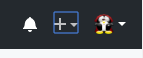
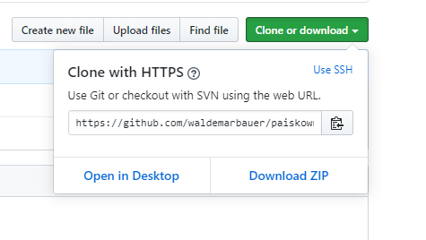

## Wstęp do Git

Celem tego skryptu jest zapoznanie uczestników laboratorium z podstawowymi zasadami używania środowiska Git. Zostaną w nim poruszone następujące zagadnienia:
- Instalacja Git
- Inicjalizacja repozytorium Git
- Śledzenie zmian w repozytorium
- Ustawienie referencji repozytorium lokalnego do zdalnego
- Synchronizacja repozytorium lokalnego z repozytorium zdalnym
- Ręczne rozwiązywanie konfliktów

W całym skrypcie znajdują się zadania. W celu poprawnego wykonania ćwiczenia należy wykonywać je po kolei. Jako wynik zadania należy wykonać zrzut ekranu na którym znajdować się ma notatnik z imieniem i nazwiskiem osoby wykonującej zadanie oraz linia poleceń z komendami  lub przeglądarka internetowa obrazująca wykonanie polecenia. Na jedno zadanie można wykonywać kilka zrzutów ekranów. Plik z zrzutem ma być typu jpg i nazywać się: zad_nrZad[_nrZrzu].

## Instalacja Git

W celu sprawdzenia czy na twoim komputerze jest zainstalowany Git wykonaj następujące kroki:
1. Uruchom linie poleceń 
2. Wpisz komendę: `git version`

Jeżeli po wydaniu otrzymasz komunikat:

`
git version numer_wersji
`
oznacza to, że masz zainstalowane oprogramowanie niezbędne do wykonania tego laboratorium. Natomiast jeżeli w wyniku wydania komendy dostaniesz informację o błędzie należy wejść na oficjalną stronę [Git](https://git-scm.com/) i zainstalować odpowiednią wersję Git dla twojego systemu operacyjnego.

Ostatnim etapem instalacji jest ustawienie nazwy użytkownika i maila, które będzie używał Git do logowania informacji, poprzez wydanie komendy
```
$ git config --global user.name "FirstName LastName"
$ git config --global user.email "email@example.com"
```
Dla sprawdzenia wprowadzonych zmian wydaj komendę:
```
$ git config --global user.name 
$ git config --global user.email
```

## Inicjalizacja repozytorium Git

Celem tego zadania jest zapoznanie uczestników laboratorium z mechanizmem inicjalizacji repozytorium lokalnego z użyciem `git init` oraz `git clone`. 

### Schemat `git init`

Komenda `git init` przekształci katalog który nie jest objęty kontrolą wersji w lokalne repozytorium Git. 

**Zadanie 1**
1. Utwórz w dowolnym miejscu na dysku katalog o nazwie npg_imię_nazwisko (bez polskich znaków). 
2. Za pomocą linii poleceń wejdź do katalogu i zainicjuj repozytorium używając komendy `git init`.

Spowoduje to utworzenie nowego podkatalogu o nazwie .git, który zawiera [szablon repozytorium](https://git-scm.com/book/en/v2/ch00/ch10-git-internals) Git. W tym momencie żadne plik nie są jeszcze śledzone przez repozytorium.

### Schemat `git clone`

Jeśli chcemy uzyskać kopię istniejącego repozytorium Git do którego posiadamy dostęp przyznany przez administratora oraz znamy jego adres url wykonujemy polecenie `git clone`. Polecenie to kopiuje  pełną kopię prawie wszystkich danych, które posiada serwer. Żeby dokonać 'klonowania' repozytorium w dowolnym miejscu wydaj komendę:

```
git clone url_rezpoytorium
```

Spowoduje to pobranie z serwera całej struktury repozytorium razem ze wszystkimi plikami.

## Śledzenie zmian w repozytorium

Na tym etapie w katalogu utworzonym w **zadaniu 1** znajduje się puste repozytorium gotowe do rozpoczęcia z nim pracy. Podstawowy schemat dodawania plików do repozytorium oraz ich śledzenie ma 

**Zadanie 2** 
1. Utwórz plik README.md w swoim katalogu i wprowadź do niego jedną linie dowolnego tekstu.
2. Upewnij się, że plik README.md znajduje się w katalogu roboczym, sprawdzając status repozytorium przy pomocy polecenia [`git status`](https://git-scm.com/book/en/v2/Git-Basics-Recording-Changes-to-the-Repository#_checking_status).
3. Dodaj README.md z katalogu roboczego do magazynu za pomocą [`git add`](https://git-scm.com/book/en/v2/Git-Basics-Recording-Changes-to-the-Repository#_tracking_files) `nazwa_pliku`.
4. Sprawdź czy operacja powiodła się za pomocą `git status`.
5. Zatwierdź zmiany w pliku README.md w swoim repozytorium za pomocą polecenia [`git commit`](https://git-scm.com/book/en/v2/Git-Basics-Recording-Changes-to-the-Repository#_committing_changes) `-m "komentarz"` 
6. Upewnij się, że operację powiodły się przy pomocy polecenia `git status`.

Należy pamiętać, że pliki dodane i zatwierdzone do repozytorium nie można usuwać, zmieniać nazw i przenosić bez zaznaczenia tego repozytorium. Bardziej dokładnie mówiąc jeżeli usuniemy, zmienimy nazwę lub przeniesiemy plik który jest śledzony za pomocą narzędzi systemowych zostanie on odtworzony przy następnym poleceniu `commit`. Żeby tego uniknąć należy używać komend:
- do usuwania pliku z dysku i repozytorium: `git rm nazwa_pliku`
- do kopiowania w obrębie repozytorium lub zmiany nazwy  pliku: `git mv scieżka1 ścieżka2`

## Ustawienie referencji repozytorium lokalnego do zdalnego
W tym momencie nasze lokalne repozytorium jest gotowe do tego by móc je synchronizować z repozytorium zdalnym. W tym celu musimy posiadać serwerową aplikację Git, za którą posłuży nam [Github](github.com). 

### Utworzenie repozytorium zdalnego na [Github](github.com)
**Zadanie 3**
1. Zaloguj się na swoje konto [Github](github.com).
2. W prawym górnym rogu wybierz plus  a następnie zakładkę **New repository**.
3. Ustaw **Repository name** npg_imię_nazwisko (bez polskich znaków).
4. Ustaw repozytorium jako prywatne.
5. Nie dodawaj żadnych innych opcji.

Po utworzeniu repozytorium wejdź do niego i znajdź adresu url w następującym miejscu:

  
 
 następnie go skopiuj. Możemy przystąpić do synchronizacji repozytorium lokalnego ze zdalnym.
 
 **Zadanie 4**
1. W linii poleceń ustawionej na lokalizację folderu z repozytorium należy ustawić adres zdalnego repozytorium przy pomocy polecenia: `git remote add origin url_rezpoytorium`
2. Następnie wgraj lokalne zmiany na serwer przy pomocy komendy: `git push -u origin master`
3. Sprawdź w przeglądarce czy wszystkie pliki zostały umieszczone na serwerze.

Przy kolejnych wysłaniach na serwer wystarczy używać polecenia: `git push`


## Rozwiązywanie konfliktów w Git

Konflikt to stan jaki możemy wywołać w repozytorium Git jeżeli dwóch użytkowników edytowało dokładnie ten sam fragment pliku w tej samej rewizji. Stan ten nie jest niczym nadzwyczajnym w środowisku pracy z Git. 

W tym miejscu przedstawiony zostanie sposób wywołania i rozwiązania konfliktu. W tym celu nie zbędne będzie stworzenie drugiej kopi naszego repozytorium zdalnego i zmodyfikowanie zawartości plików, żeby zasymulować pracę dwóch osób. Ten etap obrazuje **zadanie 5**. 

**Zadanie 5**
1. W linii poleceń Przejdź w dowolne miejsce na dysku gdzie nie znajduje się katalog z **zadania 1**.
2. Sklonuj repozytorium zdalne przy pomocy komendy: `git clone url_rezpoytorium`
3. Wejdź w utworzony katalog i zedytuj w dowolny sposób plik README.md.
4. Następnie wprowadź zmiany do repozytorium i wyślij je na serwer:
	1. `git status`
	1. `git add README.md`
	1. `git commit -m 'twoja_wiadomość'`
	1. `git push`
5. Sprawdź wersję plików na serwerze.

Po wykonaniu poprzedniego zadania możemy wrócić do pracy z repozytorium pierwotnie przez nas utworzonym. W celu wyłania konfliktu na początku będziemy edytować w pliku README.md tą samą linie co w klonie naszego repozytorium. Następnie wprowadzimy zmiany do repozytorium lokalnego a w następnym kroku synchronizujemy je z repozytorium zdalnym, co wywoła konflikt. Proces ten omawia **zadanie 6**.
  
**Zadanie 6**
1. Wprowadź zmiany w tej samej linii pliku README.md ale różniące się od wersji z **zadania 5**.
2. Następnie wprowadź zmiany do repozytorium:
	1. `git status`
	1. `git add README.md`
	1. `git commit -m 'twoja_wiadomość'`
3. W kolejnym kroku spróbuj synchronizować repozytorium lokalne ze zdalnym przy użyciu polecenia: `git pull`. Po jej wykonaniu powinien pojawić się komunikat:
```
Auto-merging README.md
CONFLICT (content): Merge conflict in README.md
Automatic merge failed; fix conflicts and then commit the result.
```
4. Otwórz plik README.md w edytorze. Po jego otworzeniu powinien ukazać się następujący schemat:
```
<<<<<<< HEAD
Tekst z repozytorium lokalnego
=======
Teks z repozytorium zdalnego
>>>>>>> 68389247f543e20d26cdd8e12091da001ccb1423
```
Git w ten sposób zaznacza konflikt w plikach. Żeby go rozwiązać należy zedytować taki fragment według przyjętej logiki projektu/zadania/pracy. W takim przypadku najczęściej fragment taki zastępuję się którąś z dostępnych wersji lub pozostawia obie usuwając linie zaczynające się od `<<<<<<<`,`=======` i `>>>>>>>`.

5. Wprowadź zmiany w pliku README.md tak by *tekst z repozytorium lokalnego* został rozwiązaniem konfliktu.
6. Wprowadź zmiany do repozytorium i synchronizuj je z serwerem zdalnym:
	1. `git status`
	1. `git add README.md`
	1. `git commit -m 'twoja_wiadomość'` opcjonalnie `git commit -a` by Git dodał informację o ręcznym rozwiązaniu konfliktu.
	1. `git push`
7. Sprawdź wersję plików na serwerze.

**Zadanie 7** 
1. Dokonaj synchronizacji repozytorium sklonowanego z repozytorium zdalnym. 
2. Sprawdź czy operacja udała się.

## Przydatne linki:
- [Git strona oficjalna](https://git-scm.com/)
- [Tutorial Github](https://github.com/github-campus-advisors/Campus-Advisor-Training)
